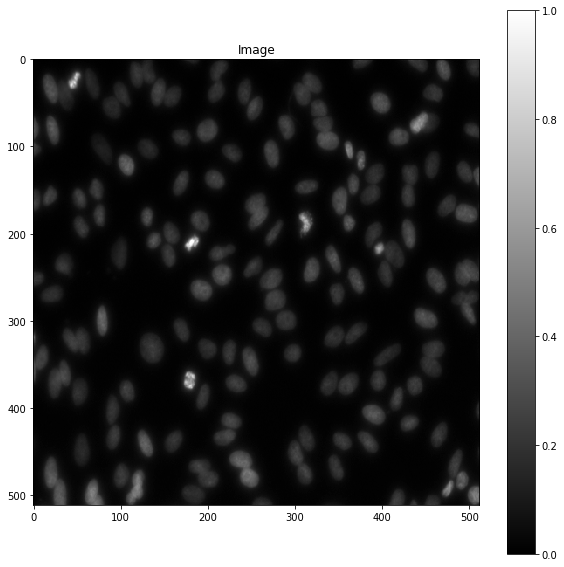
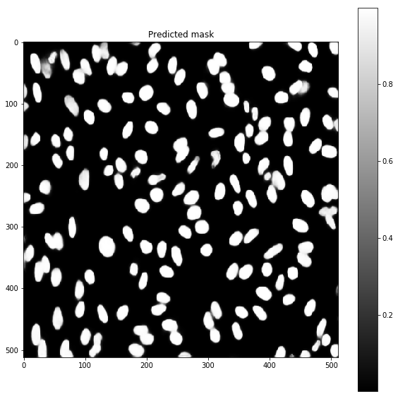
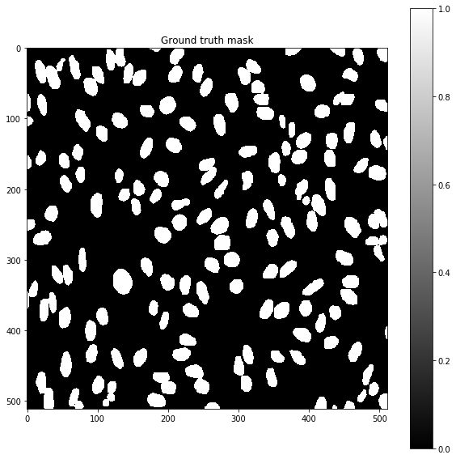

# Semantic Image Segmentation 

This notebook contains the model training part of a image segmentation workflow, which was developed as part of Kaggle 2018 Data Science Bowl competition submission. 

The model is based on convolutional neural network and it contains approximately one hundred layers. The architecture is loosely based on U-Net and One Hundred Layer Tiramisu models, which both are popular in segmentation tasks. The model can perform semantic segmentation only. If instance segmentation is required, it has to be done in post-processing steps, for example, using watershed algorithm. 

The model in this notebook has been slightly simplified so that it predicts only one output class, i.e. foreground vs. background class, which is the most typical case. It is very straighforward to modify it for multiple class predictions. 

## Sample images

Input image:



Model predictions:



Ground truth target:




## Variations

I have also run this model using pixelwise weighted loss function (weighted DICE loss) and it works fine for emphasizing segment borders, like described in the U-net paper: https://lmb.informatik.uni-freiburg.de/people/ronneber/u-net/ 

The weighted loss function can be such as:
```python
def weighted_dice(y_true, y_pred):
    # Setup for tensorflow backend ch order
    weight_f = K.flatten(y_true[:, :, :, 1])
    y_true_f = K.flatten(y_true[:, :, :, 0])
    y_pred_f = K.flatten(y_pred) 
    smooth = 1.
    num = (2. * K.sum(y_true_f * y_pred_f) + smooth)
    denominator = (K.sum(y_true_f) + K.sum(y_pred_f * weight_f) + smooth)
    return -1. * (num / denominator)
'''
Then just pass the pixel weight array in the target channel 1 and keep the model output as such (single channel output and the  training mask channel 0 contains the target mask). When using heavy loss weights for certain areas, make sure that those correspond to some real spatial features in the input images. If you try to force the model to separate overlapping instances when there is no real borderline separating those in the image, the model will just get confused and it will leave very wide border between the instances and produces heavily dilated segment masks. 